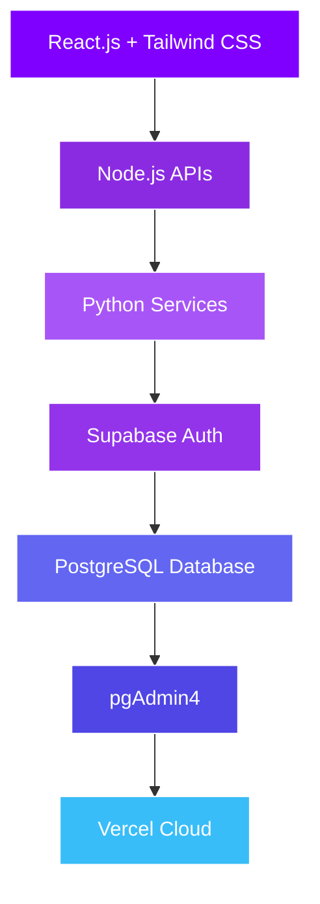

<div align="center">

<p align="center">


<br>


<br>

<a href="https://abdulkalam.vercel.app">
  
</a>
<a href="https://www.linkedin.com/in/syed-abdul-kalam-15007a289/">
  
</a>
<a href="https://github.com/Abdulkalam-AIML">
  
</a>

<br><br>


</div>

<br>

## 👨‍💻 About Me


I am **Syed Abdul Kalam**, an aspiring **Artificial Intelligence Engineer**, **Full Stack Developer**, and **Founder of NexLayer Private Limited** from India 🇮🇳.

I am passionate about building intelligent software systems, creating innovative products, and solving real-world problems through technology.

```yaml
name: Syed Abdul Kalam
role: Founder & CEO @ NexLayer Private Limited
education: B.Tech CSE (Artificial Intelligence & Machine Learning)
focus: [AI Engineering, Full Stack Development, Generative AI, Prompt Engineering]
mission: "Build intelligent products that create meaningful impact for millions"
```

<br clear="right"/>

### 🚀 What Defines Me

<div align="center">

| 🧠 AI Engineer | 🤖 AI Developer | 🌐 Full Stack Dev | 📱 App Developer |
|:---:|:---:|:---:|:---:|
| ✨ Prompt Engineer | 🏢 Founder & CEO | 💡 Product Thinker | ⚡ Problem Solver |

</div>

<br>


## 📖 Founder Story

Technology always fascinated me because software can change lives.

I started my journey by learning programming, building projects, experimenting with Artificial Intelligence, and solving real-world business problems.

Today, I continue building products that combine:

<div align="center">

`Artificial Intelligence` `Software Engineering` `Business Automation` `Cloud Technologies` `Product Innovation`

</div>

> 💜 *My mission is to build intelligent products that create meaningful impact and are used by millions worldwide.*

<br>

<div align="center">

<h1 align="center">🚀 NexLayer Private Limited</h1>
<p align="center">
Building the Next Layer of Intelligent Technology
</p>


<h3 align="center">
Building the Next Layer of Intelligent Technology
</h3>

<p align="center">
AI • Software Engineering • Automation • Cloud Solutions
</p>


</div>

### 🎯 Mission
Empower businesses and individuals through innovative software, Artificial Intelligence, and intelligent automation.

### 🌍 Vision
Build globally recognized technology products that positively impact millions of lives.

### 💎 Core Values

<div align="center">


</div>

### 🚀 Areas We Build In

<div align="center">


</div>

<br>


## 📈 Startup Journey

```text
2026
│
├── 🚀 Founded NexLayer Private Limited
├── 💻 Started Building Intelligent Systems
├── 🤖 Developed AI-Powered Applications
├── ⚡ Built Business Software Solutions
├── 📈 Achieved Revenue Milestones
├── 🌍 Building Technology for Global Impact
└── 🚀 Mission: Create Products Used by Millions
```

<br>

## 🤖 Artificial Intelligence & Engineering

<div align="center">


</div>

<h2 align="center">💻 Technology Stack</h2>

<p align="center">

</p>

## 🏗️ Architecture Flow

<div align="center">



</div>


## 🚀 Featured Projects

<table align="center">
<tr>
<td width="33%" valign="top">

### 🤖 AI Applications
- AI Chatbots
- AI Agents
- Generative AI Platforms
- Smart Prediction Systems

</td>
<td width="33%" valign="top">

### 🏢 Business Software
- ERP Platforms
- Billing Systems
- Inventory Management
- Analytics Dashboards

</td>
<td width="33%" valign="top">

### 🌐 Intelligent Platforms
- Student Dashboards
- SaaS Platforms
- Business Automation Tools
- Cloud Applications

</td>
</tr>
</table>

<br>

## 🎯 Current Focus

<div align="center">


</div>

<br>

## 🌍 Vision 2030

<div align="center">

✅ Become a World-Class AI Engineer&nbsp;&nbsp;|&nbsp;&nbsp;✅ Build Products Used by Millions&nbsp;&nbsp;|&nbsp;&nbsp;✅ Scale NexLayer Globally

✅ Build Innovative SaaS Platforms&nbsp;&nbsp;|&nbsp;&nbsp;✅ Create Intelligent Systems&nbsp;&nbsp;|&nbsp;&nbsp;✅ Inspire Future Developers

✅ Create Technology That Changes Lives

</div>

<br>


## 📊 GitHub Analytics

<div align="center">


<br>


</div>

<br>


## 🐍 Contribution Snake

<div align="center">


</div>

<br>

## 💭 Philosophy

<div align="center">


</div>

<br>

<div align="center">

# 💜 Thank You for Visiting My Profile

### 🚀 Founder & CEO • NexLayer Private Limited
### 🤖 AI Developer • 🌐 Full Stack Developer • 📱 App Developer • ✨ Prompt Engineer
### 💜 Building the Next Layer of Intelligent Technology

<br>

[](https://abdulkalam.vercel.app)
[](https://www.linkedin.com/in/syed-abdul-kalam-15007a289/)
[](https://github.com/Abdulkalam-AIML)


</div>

